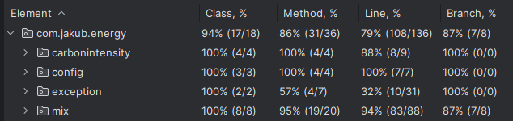

# Energy Mix API

This is a Spring Boot application that provides UK data on energy mix and helps find the optimal time for charging based on the cleanliness of the energy sources. The application fetches data from the [Carbon Intensity API](https://api.carbonintensity.org.uk/).

## Technologies Used

- **Java 21**: The core programming language.
- **Spring Boot 3**: The framework for building the application.
- **Maven**: The build and dependency management tool.
- **Lombok**: A library to reduce boilerplate code.

## Getting Started

### Prerequisites

- Java 21 or higher
- Maven

## API Endpoints

The API is available under the `/energy` path.

### 1. Get 3-Day Energy Mix

-   **Endpoint:** `GET /energy/mix`
-   **Description:** Returns the average energy mix for the current day and the next two days. The mix is calculated based on the percentage of different fuel types.
-   **Success Response (200 OK):**
    ```json
    [
      {
        "date": "2025-11-23",
        "averageGenerationMix": {
            "hydro": 0.016666666666666666,
            "other": 0.0,
            "biomass": 9.106250000000001,
            "imports": 11.833333333333334,
            "gas": 11.433333333333337,
            "solar": 2.5687499999999996,
            "coal": 0.0,
            "nuclear": 13.568749999999996,
            "wind": 51.45208333333332
        },
        "cleanEnergyPercentage": 76.71249999999998
      },
      ...
    ]
    ```

### 2. Get Optimal Charging Window

-   **Endpoint:** `GET /energy/optimal-charging`
-   **Description:** Calculates the best time window to charge a device based on the highest percentage of clean energy sources in the upcoming 48 hours.
-   **Query Parameters:**
    -   `durationHours` (optional, integer): The desired charging duration in hours.
        -   `Min`: 1
        -   `Max`: 6
        -   `Default`: 3
    ```json
    {
      "startTime": "2025-11-23T21:30:00",
      "endTime": "2025-11-24T03:30:00",
      "averageCleanEnergyPercentage": 75.73333333333335
    }
    ```

### 3. Test Coverrage

